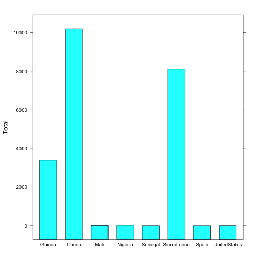

2014 Ebola Outbreak 
========================================================
author: Zach Christensen
date: 23 May 2015

Importance of Understanding Outbreak
========================================================

In 2014, the worst Ebola outbreak in history occured in Western Africa. Ebola outbreaks are typically small, with the virus infecting and beating hosts faster than it can be spread. A host of factors contributed to the devasting effects of this outbreak:

- Poverty
- Broken Healthcare Systems
- Local customs that increased exposure
- Spread of virus to densely populated areas

Accuracy of Data
========================================================

As the world struggled to catch up with the raging epidemic, one of the largest shortcomings was the collection, validation, and sharing of data between the various groups involved with the containment and relief efforts.

To address this issue, Caitlin Rivers, a grad student in computational epidemiology at the Network Dynamics and Simulation Science Laboratory at Virginia Tech, began compiling data from various sources in a <a href="https://github.com/cmrivers/ebola">Github repo</a>. This provided the data in the necessary 'raw' format for more detailed analysis, and 'crowdsourced' the effort to ensure its validity.

A Look At The Data
========================================================


```r
library(dplyr)
library(lattice)
data <- read.csv("graph_data.csv")
```

The outbreak affected these countries:

```r
paste(unique(data$Country))
```

```
[1] "Guinea"       "Liberia"      "SierraLeone"  "Nigeria"     
[5] "Senegal"      "UnitedStates" "Spain"        "Mali"        
```

Resulting in more than 15938 confirmed cases.

Total Cases By Country
========================================================


```r
countrySums <- data %>% group_by(Country) %>% summarise(Total = sum(Value))
barchart(Total ~ Country, countrySums)
```

 
